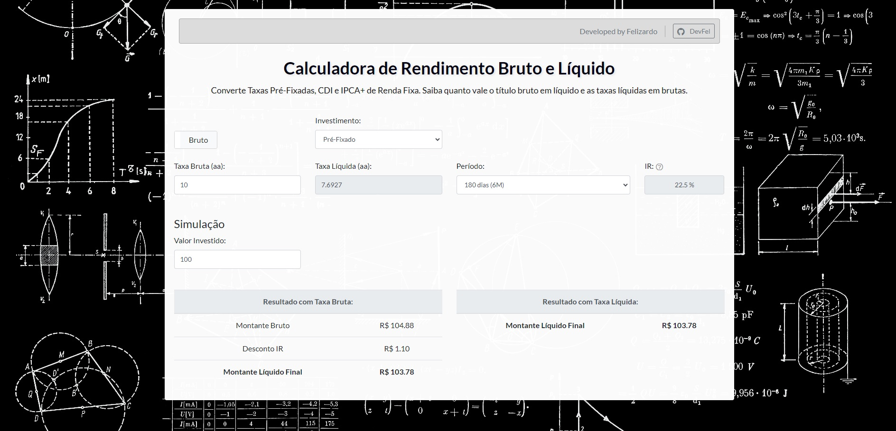

  

# 📊 Calculadora de Rendimento Bruto e Rendimento Líquido 🧮

## Converte Taxas Pré-Fixadas, CDI e IPCA+. Saiba quanto vale o título bruto em líquido e as taxas líquidas em brutas corretamente. Utilizado especialmente para Investimentos de Renda Fixa.

## Table of Contents

- [Sobre o Projeto](#sobre-o-projeto)
- [Características](#características)
- [Como Usar](#como-usar)
- [Requisitos](#requisitos)
- [Estrutura do Código](#estrutura-do-código)
- [Funções JavaScript](#funções-javascript)
- [Licença](#licença)
- [Contribuição](#contribuição)

## Sobre o Projeto

Esta é uma Calculadora de Juros Bruto e Líquido para rendimentos que permite aos usuários converter Taxas Pré-Fixadas, CDI e IPCA+. O software fornece informações sobre quanto vale o título bruto em líquido e as taxas líquidas em brutas. Saiba quanto vale o título bruto em líquido e as taxas líquidas em brutas corretamente. Utilizado especialmente para Investimentos de Renda Fixa.

## 🌟 Características

- Interface amigável com campos para entrada de dados.
- Calcula taxas líquidas e brutas baseadas em diferentes tipos de investimento.
- Atualização em tempo real dos resultados baseada nas entradas do usuário.
- Informações sobre Imposto de Renda baseadas no período de investimento.
- Simulação do retorno do investimento com base nos parâmetros fornecidos.

## 🚀 Como Usar

1. Abra a página no navegador.
2. Selecione o tipo de investimento desejado (Pré-Fixado, CDI, IPCA).
3. Insira os valores nos campos fornecidos.
4. Os resultados serão exibidos e trocados simulataneamente e recalculados a cada alteração.

## 🔧 Requisitos

- Um navegador moderno que suporte HTML5, CSS3 e JavaScript.
- Acesso a internet para carregar bibliotecas externas (Bootstrap, jQuery, etc).

## 📂 Estrutura do Código

O código é estruturado em HTML, CSS e JavaScript. O HTML fornece a estrutura básica da página, enquanto o CSS (incluindo Bootstrap) é usado para estilização. O JavaScript é utilizado para toda a lógica de cálculo e interação.

## Funções Utilizadas

- **getAliquotaIR()**: Esta função determina a alíquota do Imposto de Renda com base no período de investimento.
- **taxaAnualParaMensal() e taxaMensalParaAnual()**: Estas funções convertem taxas de juros anuais para mensais e vice-versa.
- **calcularResultados()**: Esta função calcula os montantes finais com base nas entradas do usuário.
- **calcularTaxaEquivalente()**: Função que determina se deve calcular a taxa líquida ou bruta e chama a função apropriada.
- **calcularTaxaLiquida() e calcularTaxaBruta()**: Estas funções calculam a taxa líquida ou bruta, respectivamente, com base nas outras entradas. É a função mais importante do código. Utilizando o método de bissecção, a função tenta encontrar uma taxa de retorno líquida que, quando aplicada ao valor investido pelo período, resulta em um montante equivalente ao montante bruto menos o imposto. O método de bissecção é um método numérico iterativo que busca a raiz de uma função. Ele começa com um intervalo inicial, que é continuamente dividido até que o valor estimado esteja suficientemente próximo do valor desejado.

## 📜 Licença

Este projeto está licenciado sob a Licença MIT.

## 🙌 Contribuição

Sinta-se à vontade para fazer fork do projeto, abrir issues e fornecer pull requests e sugestões.
